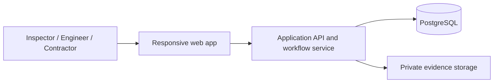

# Proposed Architecture - Gujarat R&B Bridge Lifecycle MVP

**Status:** proposed, pending the team's explicit bridge-class decision and
organizer workflow confirmation. No implementation has begun.

## Product boundary

Build a web application for one Gujarat R&B division that manages the lifecycle
of a bridge from registered asset, through inspection and maintenance, to
verified operational closure. This is not a structural-engineering tool, a
statewide GIS, or a replacement for R&B's existing systems.

## Why this product

Research into MoRTH IBMS/RAMS, US DOT practice, and enterprise bridge systems
shows the same essential loop: inventory -> inspection -> action -> work ->
verification -> history. The MVP implements that loop with accountable roles
and evidence. See `docs/bridge-research-dossier.md`.

## MVP architecture



### Recommended implementation shape

A single full-stack TypeScript application with a relational PostgreSQL
database is the default recommendation, subject to team familiarity at
kickoff. It permits one codebase and deployment while keeping lifecycle rules
server-side. Use object storage only if actual photo uploads are implemented;
otherwise use seeded/mock evidence for the demo.

Do not introduce microservices, queues, GIS infrastructure, AI services,
external government integrations, or a separate analytics store for the MVP.

## Product modules

| Module | Responsibility | Why it exists |
|---|---|---|
| Bridge inventory | Stable asset passport, ownership, location, current state | A lifecycle needs a durable subject and source of truth |
| Inspections | Scheduled/due inspection, condition, defects, evidence | Mirrors the data-collection starting point in real systems |
| Triage | Converts an entered severity into an accountable action queue | Ensures the app manages, rather than merely records, assets |
| Maintenance work | Approval, assignment, deadline, completion evidence | Connects a defect to an actual intervention |
| Verification | Authorised closure after repair | Stops self-certification and preserves governance |
| Timeline/dashboard | Immutable history and actionable portfolio queues | Supports auditability and manager decisions |

## Roles and permissions

| Role | Permitted actions |
|---|---|
| Inspector / Deputy Engineer | View assigned bridges; submit inspection and evidence |
| Executive Engineer | Review findings; approve/assign work; verify completion |
| Contractor | View assigned work; submit completion evidence only |
| Superintending Engineer | Read division dashboard, bridge history, and pending approvals |

All permission checks belong on the server. UI hiding is not authorization.

## Lifecycle state machine

```text
Registered -> Operational -> Inspection Due -> Under Inspection
Under Inspection -> Operational                  (no actionable finding)
Under Inspection -> Attention Required           (high/critical finding)
Attention Required -> Maintenance Approved
Maintenance Approved -> Repair In Progress
Repair In Progress -> Verification Pending
Verification Pending -> Operational              (engineer verifies)
Operational -> Retired                           (future/administrative path)
```

The condition/severity is inspector-entered demo data, not an automated
structural-safety calculation. A contractor cannot transition an asset back to
Operational.

## Core request flows

### Inspection to action

```text
Inspector submits inspection + defect + evidence
-> server validates inspector role and bridge ownership/division
-> inspection, defect, and timeline event persist atomically
-> high/critical result opens an attention-required case
-> Executive Engineer sees it in approval queue
```

### Repair to closure

```text
Executive Engineer approves maintenance and assigns contractor
-> contractor submits completion evidence
-> state becomes Verification Pending
-> Executive Engineer verifies or rejects
-> verified closure records timeline event and returns bridge to Operational
```

## Source of truth

- PostgreSQL: bridge identities, workflow state, inspections, defects, work
  orders, approvals, and event timeline.
- Object storage: actual uploaded photos/documents, if enabled.
- Database rows store evidence metadata and private object references, never
  the binary file itself.

## Demo dataset

Seed 3-5 fictional bridges in one R&B division:

- one operational/good bridge;
- one inspection due;
- one high-severity defect awaiting approval;
- one repair awaiting verification;
- one completed, historically repaired bridge.

This ensures every important state is visible without relying on live data or
external services.

## Explicit non-goals

- road segments or government buildings;
- GIS maps, satellite imagery, sensors, digital twins, or predictive AI;
- structural scoring, load rating, or compliance certification;
- tendering, procurement, budgets, payments, and contractor billing;
- real integration with WMS, IBMS, or RAMS without approved access.

## Deployment and failure approach

One web deployment, one managed PostgreSQL database, and optional managed
object storage are sufficient. A health endpoint and seeded fallback data are
required for demo reliability. If evidence storage fails, the user sees a
clear upload failure and cannot claim completion without the required evidence.
If the dashboard query fails, the underlying bridge workflow remains usable.

## Scale path

At real departmental scale, add authenticated SSO, private object storage,
GIS/linear references, mobile offline sync, inspection standards, reporting
adapters, and background notification/report jobs only when a validated need
appears. The trigger is actual multi-division volume, field connectivity needs,
or authorised system-integration access.

## Open decisions before coding

1. Confirm bridge-only scope as the working asset-class decision.
2. Confirm the intended R&B approval roles and whether contractor access is in
   scope.
3. Choose the implementation stack based on team familiarity.
4. Confirm whether photo evidence is required or may be seeded/mock data.
